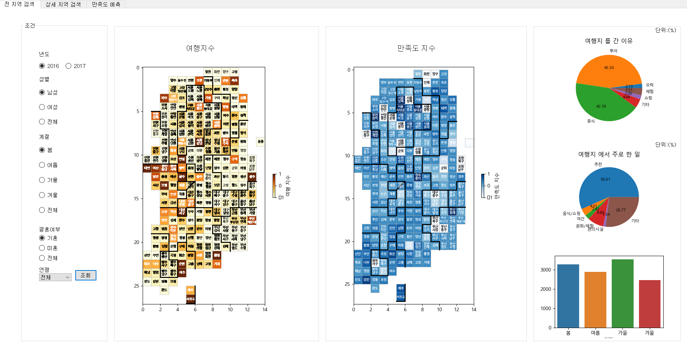
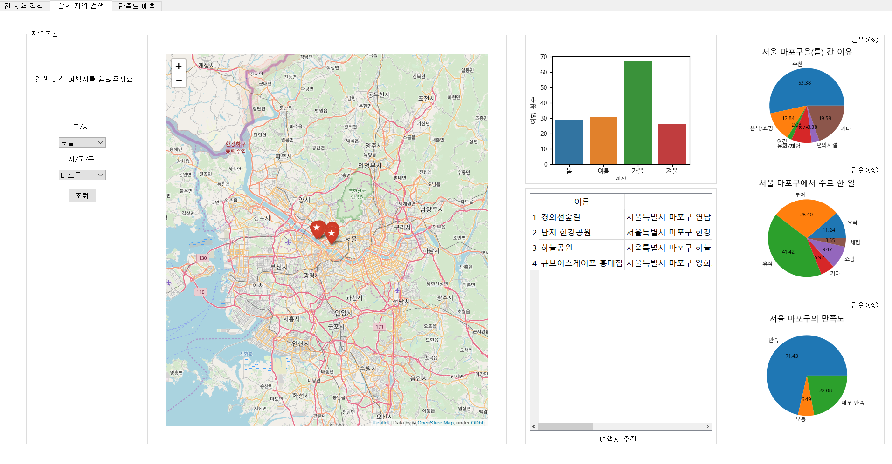
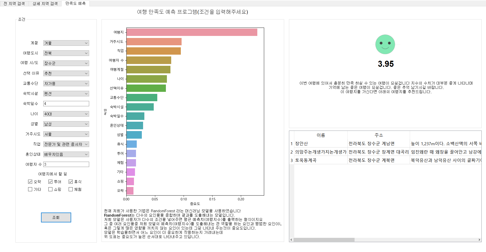

# 여행지 추천 프로젝트

> 프로젝트 참여자 : 김환, 남준우, 윤승후, 조재신, 김건희

#### 한국문화관광연구원 2016 2017 자료 이용

---

설명:
이용 가능한 독립변수를 이용하여
종속변수를 찾아내어 여행자의 만족도를 예측하는 프로그램입니다.

1. randomeForest를 사용하여 여행자 만족도 예측.
2. dash board는 drill down 방식을 이용하여 여행지 전체 만족도와 여행 빈도수, 지역별 만족도와 여행빈도수를 보여줌.
3. 추천 여행지는 네이버 추천여행지를 crawling하여 제공.

---

- 전체적인 지역을 검색합니다.
- 만족도와 여행 빈도수, 여행지에서 어떤것을 많이 하는지 알 수 있습니다.

- 지역별로 검색합니다.
- 계절별 여행횟수, 여행지에서 하는일, 추천 여행지를 알 수 있습니다.

- 사용자에게 data를 입력받아 만족도를 예측합니다.
- 중요도에 따라 만족도에 미치는 정도가 다르게 예측됩니다.

##### ps.전체 검색 부분의 map은 "파이썬으로 데이터 주무르기 - 비제이퍼블릭" 6장의 일부 코드를 사용하였습니다."
